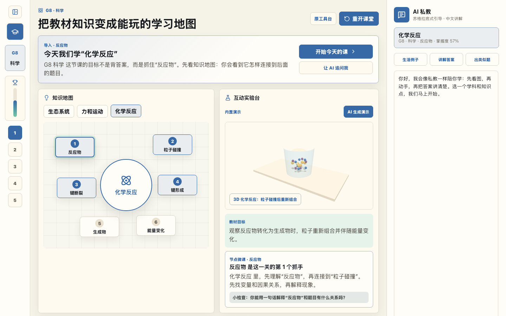

# K12 Spark Tutor Investor Demo

K12 Spark Tutor is an active AI tutoring system for K12 learning. It teaches proactively instead of waiting for students to ask questions.

## Main Demo Video

[Watch the full narrated investor walkthrough](./demo-recordings/k12-tutor-investor-full-narrated.mp4)

## What The Full Demo Shows

- Active lesson flow: hook, teacher modeling, guided practice, independent challenge, summary.
- Left-side learning setup that auto-collapses after grade or subject selection, giving more room to the classroom view.
- Knowledge map that links textbook concepts to lesson steps and challenge questions.
- Interactive 3D science visualization for chemistry reactions, force and motion, and ecosystem energy flow.
- Mastery tracking, challenge feedback, hint flow, and AI tutor guidance in one classroom view.
- Multi-subject direction across math and science, with room to expand across K12 textbook units.

## Investor Angle

The product direction is not a passive homework chatbot. It is a proactive tutor that structures a lesson, visualizes abstract concepts, checks understanding, and adapts the next move based on student progress.

The cost-conscious path is to use reusable curriculum templates, controlled 3D visualization modules, and targeted AI calls only where generation or tutoring adds clear learning value.

## Short QA Clip

A shorter earlier QA clip is also available here:

[Watch the short narrated walkthrough](./demo-recordings/k12-tutor-qa-walkthrough-narrated.mp4)
