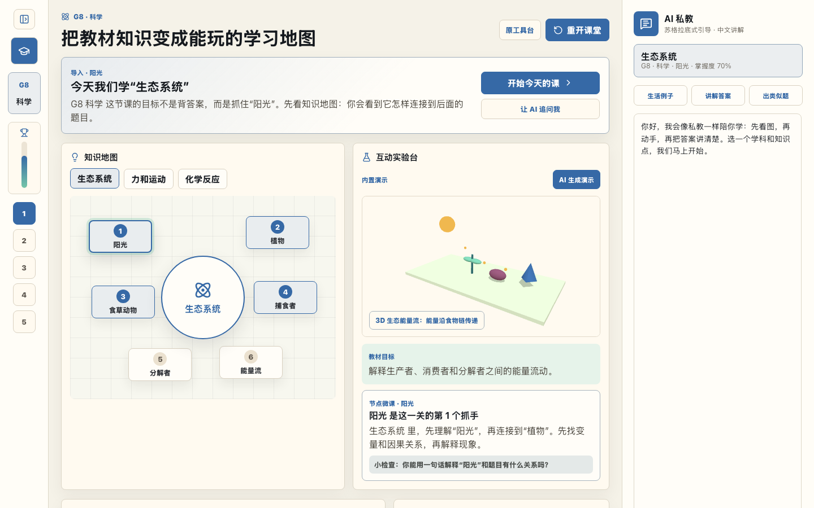

# K12 Spark Tutor Investor Demo

K12 Spark Tutor is an active AI tutoring system for K12 learning. It is designed to teach proactively instead of waiting for students to ask questions.

## Demo Video

[Watch the narrated product walkthrough](./demo-recordings/k12-tutor-qa-walkthrough-narrated.mp4)

## What The Demo Shows

- Active lesson flow: hook, teacher modeling, guided practice, independent challenge, summary.
- Left-side learning setup that auto-collapses after grade or subject selection, giving more room to the classroom view.
- Interactive 3D science visualization for chemistry reactions, force and motion, and ecosystem energy flow.
- Knowledge map, challenge questions, mastery tracking, and an AI tutor panel.
- Low-cost product direction: reusable lesson templates, controlled 3D scenes, and API-generated tutoring where needed.

## Investor Angle

The product direction is not a passive homework chatbot. It is a proactive tutor that structures a lesson, visualizes abstract concepts, checks understanding, and adapts the next move based on student progress.
